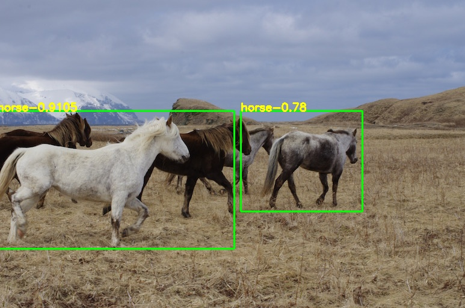
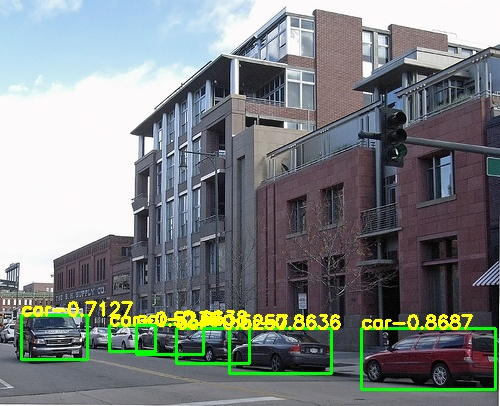

# YOLOV2_PyTorch_Train
PyTorch完美复现YOLOV2的精度和速度，配置完全相同，两者模型可以无障碍相互转换

## 指标展示
|Model| train | test | mAP | FPS |
|-----|------|------|-----|-----|
|yolov2-tiny(paper) | 0712 |	2007_test |	57.1 |	207 |
|yolov2-tiny(retrain from darknet) | 0712 |	2007_test |	0 (why?) |	207 |
|yolov2-tiny(retrain from AlexeyAB-darknet) | 0712 |	2007_test |	56.9 |	207 |
|**yolov2-tiny(ours)** | 0712 |	2007_test |	**57.7** |	**207** |

## 效果展示
      
      

## 使用说明
### 要求
> Python >= 3.6 \
> PyTorch >= 1.4
### 数据集下载
```shell script
cd <path-to-voc>/
wget https://pjreddie.com/media/files/VOCtrainval_11-May-2012.tar
wget https://pjreddie.com/media/files/VOCtrainval_06-Nov-2007.tar
wget https://pjreddie.com/media/files/VOCtest_06-Nov-2007.tar
tar xf VOCtrainval_11-May-2012.tar
tar xf VOCtrainval_06-Nov-2007.tar
tar xf VOCtest_06-Nov-2007.tar
```
### 数据生成
```shell script
cd data/voc0712
python voc_label.py
cat 2007_train.txt 2007_val.txt 2012_*.txt > train.txt
```
### 预训练模型下载
```shell script
cd pretrain
wget https://pjreddie.com/media/files/darknet.weights
```
### 训练和测试
```shell script
python train.py
```
已训练好的模型：[百度云(提取码:8888)](https://pan.baidu.com/s/1ojrQJd7QlVdgggCG6DALPg)
```shell script
python detect.py
```
### 计算mAP
模型转换至darknet
```shell script
python cvt2darknet.py
```
编译原始版本[darknet](https://github.com/pjreddie/darknet)
```shell script
./darknet detector valid cfg/voc.data cfg/yolov2-tiny-voc.cfg weights/yolov2-tiny-final.weights
```
将生成的`results`文件夹移入`eval`文件夹
```shell script
python voc_eval.py
```

## 复现重点
- `ours`采用`adam`优化器，而`darknet`采用`sgd`
- 完全复现`darknet-region_layer`的`loss`计算方式
  <br>1. 负样本：每个`grid_cell`的5个`bbox`与所有`target`的`iou<0.6`，且不属于正样本`bbox`的下标
  <br>2. 正样本：每个`grid_cell`的5个`anchors`与`targets`最大`iou`的下标，注意5个`anchors`可以分别预测多个`targets`，并不是只有一个
  <br>**3. 正样本`confidence`的`target`为`pred`与`target`的`iou`**
  <br>**4. 正样本`bbox`回归的`wh_scale`为`2-target_w*target_h`**
  <br>**5. 训练前`12800`个图像时，将所有`(~正样本)`的`bbox_xy`与对应的`grid_cell`中心点`(0.5,0.5)`回归，`scale=0.01`**

## 参考
https://blog.csdn.net/samylee  
https://pjreddie.com/darknet/yolov2  
https://github.com/pjreddie/darknet  
https://github.com/AlexeyAB/darknet
